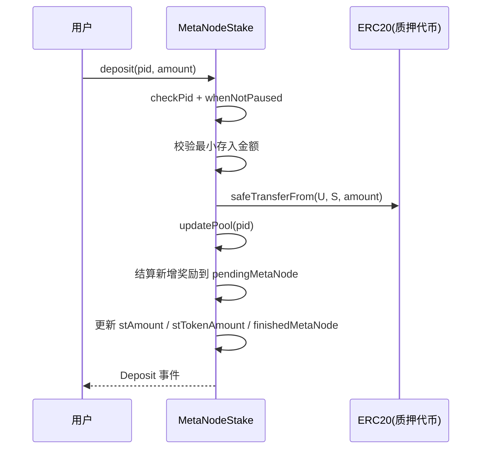
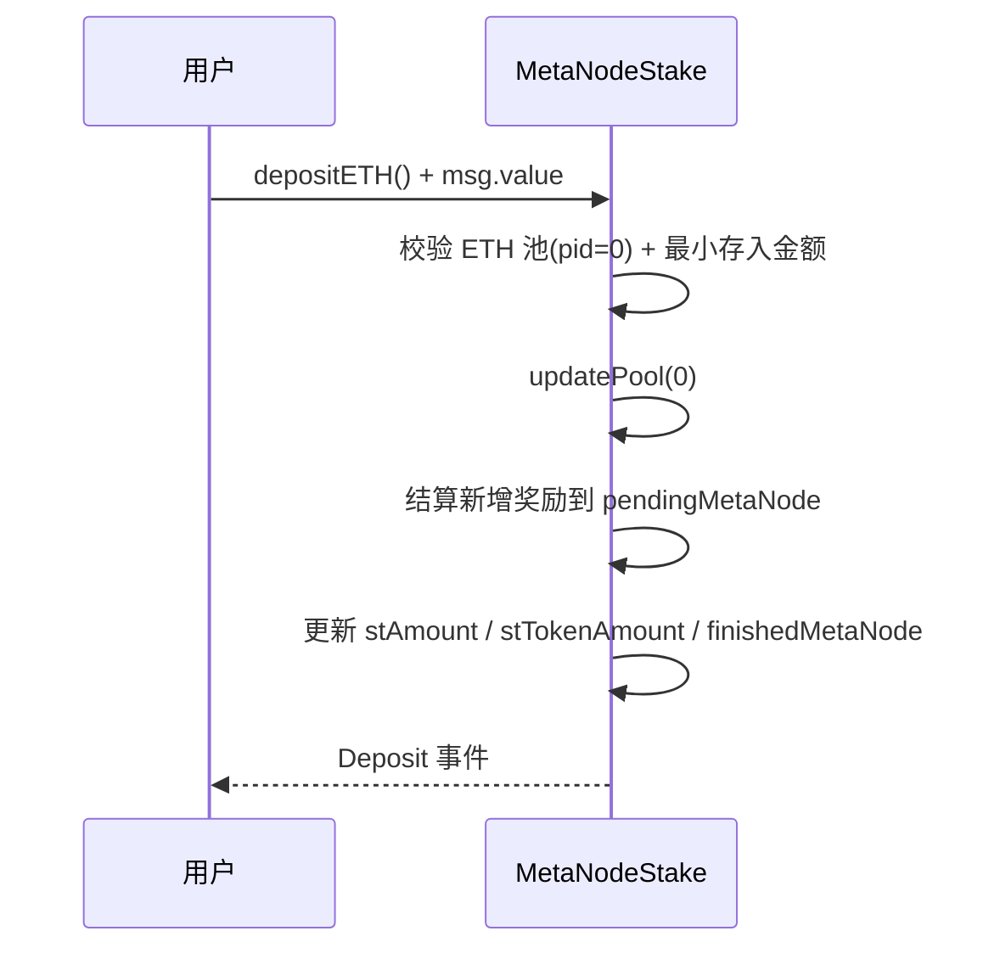
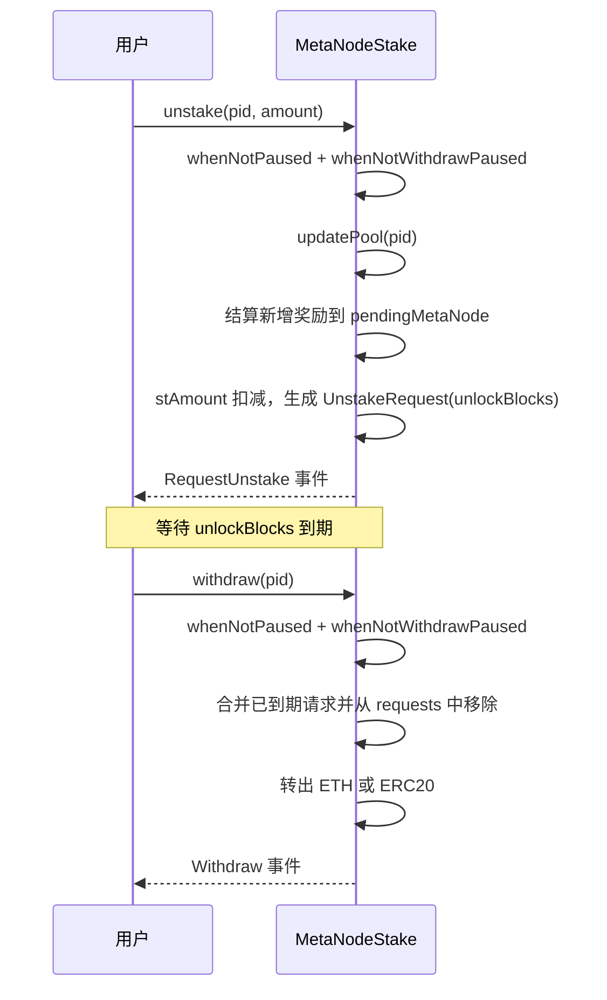
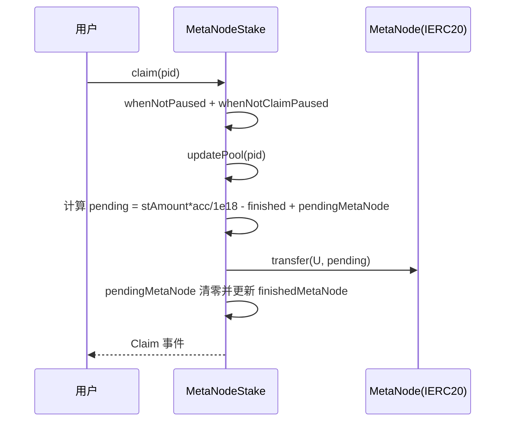
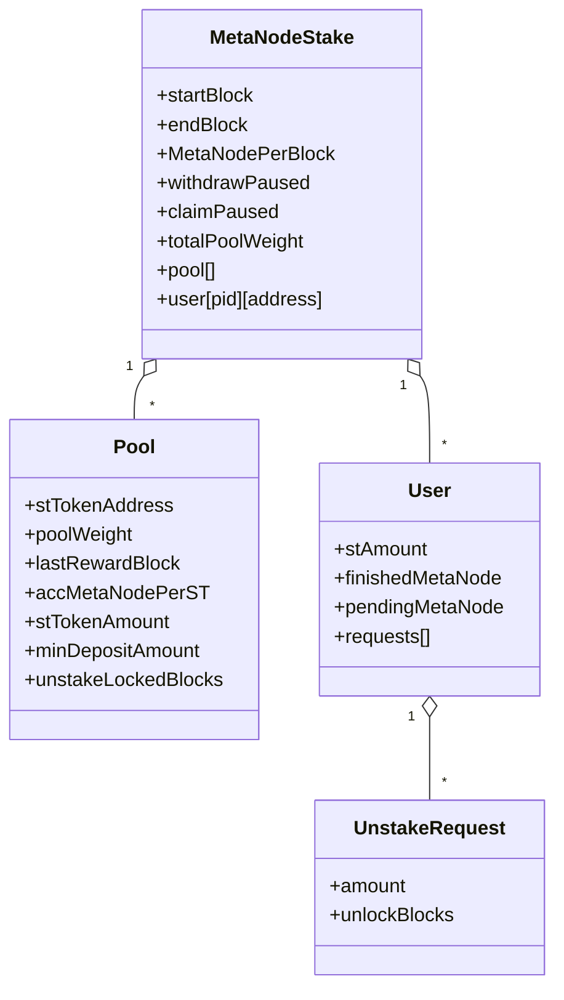
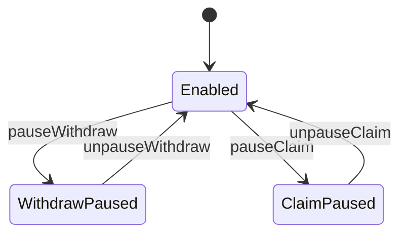
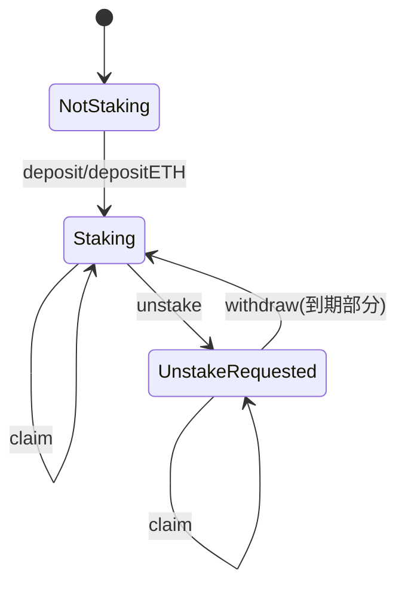

# MetaNodeStake 合约项目技术方案

## 摘要

MetaNodeStake 是一个基于以太坊的多池质押挖矿合约系统，支持用户质押 ETH 或 ERC20 代币，并按区块高度线性产出 MetaNode 奖励。方案通过资金池权重实现多资产奖励分配、通过“解质押请求 + 解锁区块”机制实现资产解锁、通过角色权限与可升级架构降低运营与迭代风险。


## 项目背景

业务诉求是提供一个“可配置、可运营、可扩展”的链上质押挖矿能力，满足以下场景：
- 同一套合约支持多种质押资产（ETH 与多个 ERC20）
- 可按运营策略动态调整不同资产的奖励权重
- 通过锁定期/解锁机制约束资金流动性，匹配风险与产品设计
- 需要可控的权限边界（参数调整、暂停功能、升级）

## 目标

- 提供多资金池的链上质押与奖励分配能力，支持按池权重拆分每区块奖励
- 通过可配置的锁定区块数，实现可预测的解质押解锁与提现节奏
- 提供可运营的管理能力（新增资金池、调整权重与参数、调整挖矿时间窗口与每区块产出）
- 提供可审计与可演进的合约形态（基于 OpenZeppelin 的权限控制与 UUPS 可升级模型）

## 非目标

- 不提供前端、索引服务、数据看板等链下系统能力（但会给出对接方式与建议）
- 不承诺任何收益率、APR 或资金规模上限；收益仅由参数与链上状态共同决定
- 不处理 KYC、风控画像等链下合规能力
- 不解决“奖励资金不足”问题（奖励发放额度取决于合约持有的 MetaNode 余额）

## 名词解释

- MetaNode：奖励代币（IERC20）
- 资金池/Pool：某一种质押资产对应的奖励分配单元，以 poolId 标识
- poolId / pid：资金池编号，等于 pool 数组下标；ETH 池固定为 0
- poolWeight：资金池权重，用于在多个池之间拆分每区块总奖励
- totalPoolWeight：所有资金池权重之和
- accMetaNodePerST：每单位质押资产累计可分得的 MetaNode（1e18 精度缩放）
- finishedMetaNode：用户已结算奖励基准（用于计算本次新增奖励）
- pendingMetaNode：用户历史累积但未领取的奖励
- UnstakeRequest：解质押请求（amount + unlockBlocks），到期后可 withdraw 提取
- startBlock/endBlock：奖励计算有效区间，区间外不产生奖励（区间裁剪在 getMultiplier 中实现）

## 总体设计

### 竞品调研

- MasterChef（典型多池挖矿模型）
  - 优势：模型成熟、链上计算成本可控、前端生态理解成本低
  - 劣势：常见实现需要额外处理解锁期、多资产（含 ETH）细节
- Synthetix StakingRewards（单池常见）
  - 优势：模型相对简单、适用于单资产
  - 劣势：多池扩展与按权重分配需要二次设计

本方案选择 MasterChef 类“累计每份额收益（acc*）”模型作为奖励核心，以降低结算复杂度，并在此基础上加入解锁请求与 ETH 池支持。

### 流程模型

系统核心交互由 4 条主流程构成：质押、解质押请求、提现、领取奖励；任意会改变用户/池状态的操作都会先 updatePool 以推进奖励累积。

#### 质押流程（ERC20）



#### 质押流程（ETH）



#### 解质押与提现流程



#### 领取奖励流程



### 数据模型

链上状态围绕 Pool 与 User 两个结构体展开，并通过映射建立“某池某用户”的状态空间。



### 设计概述

- 奖励计算采用“累计每份额收益”模型：池子通过 accMetaNodePerST 记录截至当前的每单位质押资产可分得的累计奖励，用户通过 finishedMetaNode 记录上次结算时的基准值，避免逐用户逐区块计算
- 奖励时间窗口通过 getMultiplier 对区间进行裁剪（[startBlock, endBlock]），保证窗口外不产出奖励
- 多池奖励拆分：每个区块的总奖励为 MetaNodePerBlock，各池获得的份额由 poolWeight / totalPoolWeight 决定
- 解锁机制：unstake 只生成请求并扣减质押余额，withdraw 在请求到期后将资产转出，便于实现锁定期与分批解锁
- 权限与升级：管理员可调整参数与暂停功能；升级使用 UUPS 模式并由 UPGRADE_ROLE 约束

### 模块设计

```mermaid
flowchart TD
    subgraph Actors[角色]
        U[用户]
        A[管理员]
    end

    subgraph Contracts[合约]
        S[MetaNodeStake]
        M[MetaNodeToken / MetaNode(IERC20)]
        X[StakingToken(IERC20) / ETH]
    end

    U -->|deposit/depositETH| S
    U -->|unstake/withdraw| S
    U -->|claim| S
    S -->|transfer 奖励| M
    S -->|transferFrom/transfer| X
    A -->|addPool/updatePool/setPoolWeight| S
    A -->|setStartBlock/setEndBlock/setMetaNodePerBlock| S
    A -->|pauseClaim/pauseWithdraw| S
    A -->|UUPS upgrade| S
```

## 详细设计

### API 设计

#### 用户侧（写操作）

| 函数 | 说明 | 关键校验/行为 |
|---|---|---|
| depositETH() payable | 向 ETH 池（pid=0）质押 | 校验池为 ETH 池；amount >= minDepositAmount；先 updatePool 再结算用户奖励 |
| deposit(pid, amount) | 向 ERC20 池质押 | pid != 0；amount > minDepositAmount；safeTransferFrom 后调用内部 _deposit |
| unstake(pid, amount) | 发起解质押请求 | 需要 whenNotWithdrawPaused；先结算奖励并累加到 pendingMetaNode；生成 UnstakeRequest |
| withdraw(pid) | 提现到期的解质押资产 | 合并连续到期请求并删除；按池资产类型转出 |
| claim(pid) | 领取 MetaNode 奖励 | 需要 whenNotClaimPaused；转出成功后清零 pendingMetaNode 并更新 finishedMetaNode |

#### 管理员侧（写操作，ADMIN_ROLE）

| 函数 | 说明 |
|---|---|
| setMetaNode(MetaNode) | 设置奖励代币地址（不自动注入余额） |
| setStartBlock(startBlock) | 更新挖矿起始区块 |
| setEndBlock(endBlock) | 更新挖矿结束区块 |
| setMetaNodePerBlock(x) | 更新每区块总奖励 |
| addPool(token, weight, minDeposit, lockedBlocks, withUpdate) | 新增资金池；第一个必须是 ETH 池 |
| updatePool(pid, minDeposit, lockedBlocks) | 更新池参数（不改变权重） |
| setPoolWeight(pid, weight, withUpdate) | 修改池权重并同步 totalPoolWeight |
| pauseWithdraw/unpauseWithdraw | 暂停/恢复 withdraw（注意：也会影响 unstake） |
| pauseClaim/unpauseClaim | 暂停/恢复 claim |

#### 公共方法（任何人可调用）

| 函数 | 说明 |
|---|---|
| updatePool(pid) | 推进某池奖励累积到当前区块 |
| massUpdatePools() | 推进所有池奖励累积到当前区块（gas 随池数量增长） |

#### 读接口（视图函数）

| 函数 | 说明 |
|---|---|
| poolLength() | 池数量 |
| getMultiplier(from, to) | 返回裁剪后的奖励区间产出总量（未按权重拆分） |
| pendingMetaNode(pid, user) | 查询用户截至当前区块的可领取奖励 |
| pendingMetaNodeByBlockNumber(pid, user, blockNumber) | 模拟到指定区块的可领取奖励 |
| stakingBalance(pid, user) | 用户当前质押数量 |
| withdrawAmount(pid, user) | 统计 requests 总额与到期可提金额 |

#### 事件

用于前端/索引的关键事件：
- Deposit、RequestUnstake、Withdraw、Claim
- AddPool、UpdatePoolInfo、SetPoolWeight
- SetStartBlock、SetEndBlock、SetMetaNodePerBlock
- PauseWithdraw/UnpauseWithdraw、PauseClaim/UnpauseClaim、SetMetaNode

### 数据库设计

本项目不包含链下数据库；链上存储即为“数据库”。核心状态变量如下：
- 全局：startBlock、endBlock、MetaNodePerBlock、withdrawPaused、claimPaused、MetaNode、totalPoolWeight
- 池：pool[]（包含池参数与累积奖励变量）
- 用户：user[pid][addr]（包含用户质押、奖励结算与解锁请求队列）

### 核心状态机

#### 全局状态（功能开关）



#### 用户状态（单池维度）



### 性能设计

- gas 复杂度
  - updatePool(pid)：O(1)
  - massUpdatePools()：O(P)，P 为池数量
  - withdraw(pid)：最坏 O(R) + O(R)（两次循环 + 数组搬移），R 为该用户 requests 长度
- 容量评估与建议
  - 建议控制池数量与单用户的 unstake 请求数量（例如前端引导用户合并操作），避免 withdraw 成本过高
  - pendingMetaNodeByBlockNumber 为视图函数，链下调用成本可忽略；不建议链上合约频繁调用该视图函数

### 安全设计

- 权限与升级
  - 参数调整与池管理受 ADMIN_ROLE 控制
  - UUPS 升级受 UPGRADE_ROLE 控制（_authorizeUpgrade）
- 资产与奖励转账
  - ERC20 质押使用 SafeERC20 进行 transferFrom/transfer
  - ETH 提现使用 call 转账以兼容高 gas 接收方
  - 奖励发放使用“余额不足则最多转出余额”的安全转账，避免因精度/舍入导致 revert
- 关键风险点与缓解
  - 奖励资金不足：合约不会自动增发奖励代币，需运营在链上提前向合约充值足够 MetaNode
  - 外部代币合约风险：IERC20 接口允许配置任意代币合约，需限制为可信资产；对带回调的非标准代币需谨慎
  - 请求队列膨胀：withdraw 的数组搬移在 requests 很长时成本较高，需运营/前端控制用户行为

### 容错容灾

- 功能级降级：可单独暂停 withdraw 或 claim，降低异常扩散面（例如奖励代币异常、提现异常）
- 风险隔离：解质押采用“先请求后提现”，可在异常期阻断资产实际转出（pauseWithdraw）
- 升级修复：在发现逻辑缺陷时可通过 UUPS 升级修复（需严格管理 UPGRADE_ROLE 与升级流程）

## 项目计划

| 阶段 | 产出 | 负责人 | 预计耗时 |
|---|---|---|---|
| 需求澄清与参数敲定 | 关键参数表（start/end、产出、权重、锁定期） | 合约/产品 | 1-2 天 |
| 方案评审 | 技术方案与风险清单 | 合约/安全 | 1 天 |
| 合约实现与本地测试 | 单测通过、覆盖核心路径 | 合约 | 2-5 天 |
| 联调（前端/脚本） | 部署脚本与对接示例 | 合约/前端 | 1-3 天 |
| 安全自查/审计 | 审计报告与修复记录 | 安全/合约 | 视范围而定 |
| 测试网发布 | Sepolia 部署与验证 | 合约/运维 | 0.5-1 天 |
| 主网发布 | 主网部署与监控 | 合约/运维 | 0.5-1 天 |

## 上线计划

- 部署顺序
  - 部署 MetaNodeToken（或确认既有 MetaNode 代币地址）
  - 部署 MetaNodeStake（代理合约 + 实现合约），执行 initialize 设置 startBlock/endBlock/MetaNodePerBlock
  - 调用 addPool 创建 ETH 池与 ERC20 池，并设置权重/锁定期/最小存入
  - 向 MetaNodeStake 合约转入足够的 MetaNode 奖励余额
- 灰度建议
  - 测试网验证：重点验证 deposit/unstake/withdraw/claim 的边界与事件索引
  - 小规模主网灰度：先开放单一池或降低权重，观测指标后逐步放量
- 上线后观测指标（链上可观测）
  - 各池 stTokenAmount（资金规模）
  - 用户 requests 长度分布（提现成本风险）
  - Claim/Withdraw 成功率与失败原因（revert 信息）

## 待解决问题

- deposit 对 ERC20 的最小存入校验为 amount > minDepositAmount，而 ETH 为 >=，需确认产品期望一致性
- pauseWithdraw 当前也会影响 unstake（unstake 使用 whenNotWithdrawPaused），与“仅暂停提现”的语义需要对齐
- 合约继承了 PausableUpgradeable 并使用 whenNotPaused 修饰，但未提供对外 pause/unpause 接口，需确认是否需要全局暂停能力
- deposit/unstake/claim 未显式限制当前区块在 endBlock 之前；endBlock 后仍可质押但不再产出奖励，需确认产品是否允许
